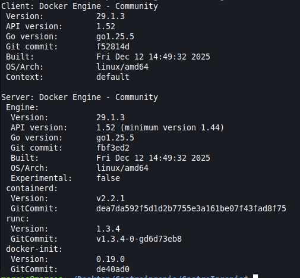
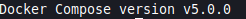
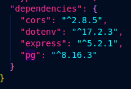
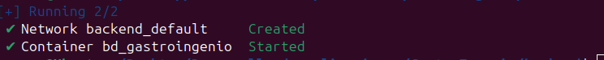
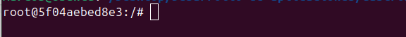
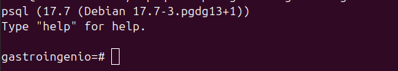
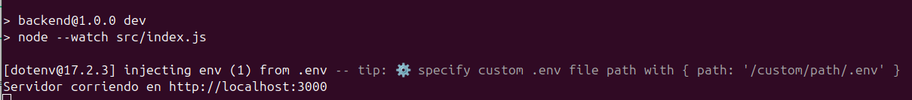
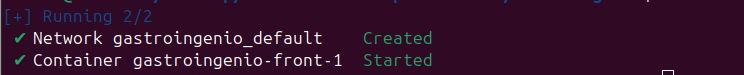

# Gastroingenio

#### Que es Gastroingenio?

GastroIngenio es una innovadora página web diseñada para facilitar el acceso a recetas de cocina de todo tipo. Esta plataforma está orientada a usuarios que buscan mejorar sus habilidades culinarias o descubrir nuevas ideas para sus menús diarios. A través de una interfaz intuitiva y atractiva, GastroIngenio ofrece una experiencia completa, desde la búsqueda de recetas hasta la visualización detallada de ingredientes y pasos de preparación.

#### Docker

Si desea ejecutar este proyecto, es necesario instalar Docker y Docker Compose para poder correr los contenedores que incluyen la base de datos y el frontend del proyecto. Para asegurarnos de que se alla descargado introduciremos los siguientes comandos en la terminal:

    docker version

debe aparacer lo siguiente:

Y cuando ingresamos este comando:

    docker compose version

debe aparacer lo siguiente:

Si se cumple lo mostrado anteriormente podemos continuar.

## Backend

El proyecto está respaldado por un robusto backend donde se emplea un servidor Express.js, que gestiona las solicitudes y respuestas de la aplicación, asegurando una estructura de rutas flexible y optimizada para el manejo de las recetas. Se implementa el uso de CORS para permitir el acceso controlado a recursos desde diferentes dominios. Por otro lado, tambien usamos dotev donde permite cargar las variables de entorno desde un archivo `.env`. Y por ultimo, El paquete `pg` nos permite interactuar con la base de datos PostgreSQL

#### como se inicia el backend?

1- Debemos asegurarnos que las dependencias se encuentren en el proyecto.

Vamos al siguiente directorio: GastroIngenio/backend.
Y asegurese de que las dependencias aparezcan en tu archivo `package.json`.

Dependencias:

   - `cors`
   - `dotenv`
   - `express`
   - `pg`

Si no están instaladas, puedes ejecutarlas con el siguiente comando en la teminal (una por una):

    npm install (dependencia)

Por ejemplo:

    npm install cors

Complete la instalacion con cada una de las dependecias hasta que aparecan todas en el anterior archivo mencionado.

2- Levantamos el contenedor que contiene la base de datos usando el siguiente comando, desde la terminal, en el directorio donde se encuentra el `docker-compose.yml` del backend. 

Directorio: GastroIngenio/backend

    docker compose up -d

3- Ingresamos a la base de datos ingresando los siguientes comandos.    
Ejecutamos el container donde se encuentra la base de datos

    docker exec -it bd_gastroingenio bash

Luego accedemos a la base de datos con el siguiente comando

    psql -U postgres -d gastroingenio

4- Las tablas y la estructura de la base de datos están definidas en el archivo schemas.sql. Asegúrate de ejecutar las sentencias SQL para crear las tablas necesarias.

    CREATE TABLE usuarios (id SERIAL PRIMARY KEY, nombre VARCHAR(30) NOT NULL, apellido VARCHAR(30) NOT NULL, edad INTEGER NOT NULL, usuario VARCHAR(30) UNIQUE NOT NULL, contrasena VARCHAR(50) NOT NULL, foto_perfil TEXT);

    CREATE TABLE recetas (id SERIAL PRIMARY KEY, id_usuario INTEGER REFERENCES usuarios(id), nombre VARCHAR(50) NOT NULL, ingredientes TEXT[] NOT NULL, pasos TEXT[] NOT NULL, descripcion TEXT NOT NULL, tiempo_preparacion INTEGER NOT NULL, comensales INTEGER, review INTEGER DEFAULT 0, fecha_creacion TIMESTAMP DEFAULT CURRENT_TIMESTAMP, imagen_url TEXT);

    CREATE TABLE comentarios (id SERIAL PRIMARY KEY, id_usuario INTEGER, id_receta INTEGER, descripcion TEXT NOT NULL, likes INTEGER DEFAULT 0, dislikes INTEGER DEFAULT 0, puntaje INTEGER DEFAULT 0, FOREIGN KEY (id_usuario) REFERENCES usuarios(id), FOREIGN KEY (id_receta) REFERENCES recetas(id));

5- Una vez configurada la base de datos, abri otra terminal en el directorio del backend y ejecuta el siguiente comando para levantar el servidor del backend.

Directorio: GastroIngenio/backend

    npm run dev

Con esto ya tendriamos el backend.

## Frontend

1- Levantamos el contenedor que contiene el Frontend con el siguiente comando en el directorio raiz.

    docker-compose up -d

2- Ingresamos en esta URL desde un navegador.

    http://localhost:8080/

Con todos estos pasos hechos, usted podra acceder al proyecto e interactuar con el.
